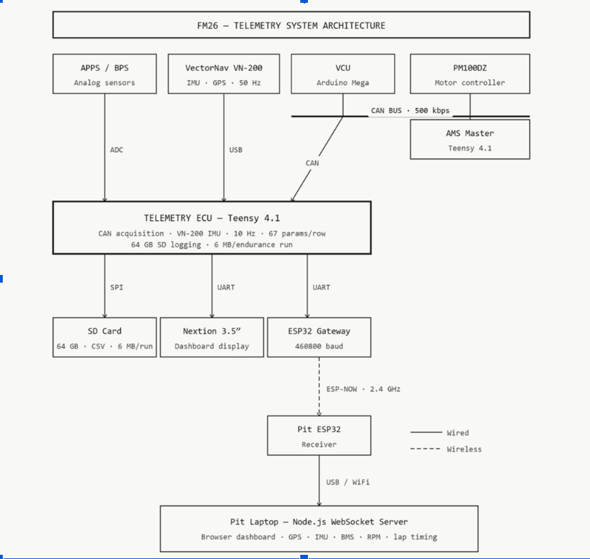

# FM26 Telemetry

Telemetry and data system for the Formula Manipal FM26 (Class 1 EV) car.



## Structure
- **firmware/** — on-car acquisition
  - `teensy_sender/` — Teensy 4.1 ECU: CAN acquisition + SD logging
  - `esp_car/` — car ESP32: UART → ESP-NOW relay
  - `esp_pit/` — pit ESP32: ESP-NOW receiver + WiFi dashboard
- **dashboard/** — pit-laptop web dashboard (JS)
- **src/** — data pipeline: `preprocess.py`, `catalogue.py`, `kpi_engine.py`, `analytics.py`
- **docs/** — technical report and architecture diagrams

## Data pipeline
```bash
pip install -r requirements.txt
python src/preprocess.py     # raw logs -> calibrated dataset
python src/catalogue.py      # build searchable run index
python src/kpi_engine.py     # compute KPIs
```
